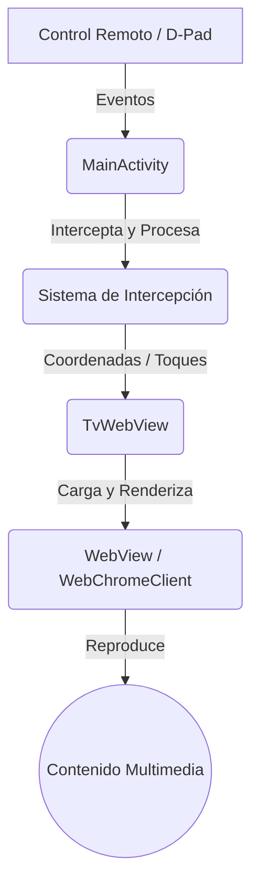

# 📺 PelisJuanita TV Bridge

**Aplicación nativa para Android TV que transforma la experiencia web tradicional en una interfaz optimizada para control remoto.**

[](https://developer.android.com/training/tv)
[](https://www.java.com/)
[-00B0FF?style=for-the-badge)](https://developer.android.com/about/dashboards)
[]()

</div>

---

> [!IMPORTANT]
> ## 👨‍💻 Mensaje del Autor (Recomendado leer)
> 
> Este proyecto nació por una necesidad muy simple: mis padres utilizan habitualmente **PelisJuanita**, pero querían disfrutarla desde el televisor. Después de probar distintos navegadores en Smart TVs, me encontré con una realidad aplastante: la experiencia suele ser **HORRIBLE, INCÓMODA y poco amigable** para usar con un control remoto.
> 
> Por eso decidí desarrollar este puente para Android TV, intentando llevar la experiencia lo más cerca posible de una aplicación nativa, con navegación optimizada, soporte para control remoto y reproducción multimedia en pantalla completa.
> 
> **Aclaración:** Este proyecto *NO* está afiliado a PelisJuanita ni reemplaza su trabajo. Mi aporte consiste únicamente en facilitar el acceso desde dispositivos Android TV. Soy meramente un **PUENTE**. Todo el mérito por la plataforma y el enorme trabajo detrás de ella corresponde a sus creadores.
> 
> ¡Un abrazo y gracias por probar la aplicación! 📺🚀
> — **Mauro G. Martínez**

---

## ✨ Características Principales

### 🎯 Cursor Virtual Inteligente
Olvídate de luchar con el mando. El bot integra un sistema de navegación pensado para televisiones:
- Navegación mediante D-Pad (flechas del control remoto).
- Cursor visual con movimiento continuo y aceleración progresiva.
- Auto-scroll inteligente (horizontal y vertical) al alcanzar los bordes de la pantalla.
- Simulación de eventos táctiles nativos para garantizar compatibilidad total con reproductores web.
- Configuración personalizada de la web y velocidad del cursor desde opciones (si tu control remoto incluye botón de configuración).

### 🎬 Experiencia Multimedia Optimizada
- Reproducción de video en **pantalla completa real**.
- Integración profunda con `WebChromeClient` para manejo avanzado de contenido multimedia.
- Aparición automática de controles al interactuar, ocultándose solos para una experiencia inmersiva.
- Gestión prioritaria del control remoto durante la reproducción de video.

### 🖥️ Optimización para Smart TV
- Aceleración por hardware habilitada por defecto.
- Renderizado optimizado para contenido HD y 4K.
- Interfaz limpia, minimalista y **sin publicidad integrada**.
- Soporte para banner *Leanback* de Android TV en la pantalla de inicio.

---

## 🏗️ Arquitectura del Proyecto

El proyecto se divide en componentes especializados para separar la lógica de entrada del renderizado web:



- **`MainActivity`**: Gestiona el ciclo de vida, intercepta los botones del control remoto e inyecta los scripts necesarios para la navegación web.
- **`TvWebView`**: Componente personalizado que renderiza el contenido, procesa el cursor virtual y controla la experiencia multimedia.
- **Capa de Intercepción**: Garantiza que las acciones del mando sean procesadas por la app nativa antes de llegar a la web.

---

## 📁 Estructura del Proyecto

```text
app/
├── java/
│   ├── MainActivity.java    # Lógica principal y gestión de eventos
│   └── TvWebView.java       # Motor de navegación personalizado
│
├── res/
│   ├── layout/
│   │   └── activity_main.xml # Interfaz de usuario
│   ├── drawable/             # Iconos y gráficos
│   └── mipmap/               # Banners de Android TV
│
├── AndroidManifest.xml       # Configuración de la app y permisos
└── .gitignore
```

---

## 🛠️ Stack Tecnológico

- **Lenguaje:** Java
- **SDK:** Android API 34 (Android 14)
- **Componentes:** Android WebView, WebChromeClient, Android TV Leanback
- **Min SDK:** API 26 (Android 8.0)

---

## 🚀 Instalación y Compilación

### Requisitos Previos
- Android Studio instalado.
- Un dispositivo Android TV o emulador configurado.

### Pasos

1. **Clonar el repositorio:**
   ```bash
   git clone https://github.com/usuario/pelisjuanita-tv-bridge.git
   cd pelisjuanita-tv-bridge
   ```

2. **Abrir en Android Studio:**
   - Abre Android Studio.
   - Selecciona `File > Open` y elige la carpeta del proyecto clonado.

3. **Compilar y Ejecutar:**
   - Sincroniza Gradle.
   - Presiona `Build > Make Project` para compilar.
   - Conecta tu Android TV (vía ADB) y presiona `Run > Run App`.

---

## 💡 Notas de Uso y Solución de Problemas

> [!NOTE]
> ### Sobre la Conectividad (DNS)
> En algunas regiones o proveedores de Internet, el acceso a PelisJuanita puede presentar inconvenientes de resolución DNS. Personalmente, he obtenido mejores resultados utilizando los **servidores DNS públicos de Google** (`8.8.8.8` y `8.8.4.4`). Sin embargo, esto puede variar según el país, el proveedor o las condiciones de red.

> [!TIP]
> ### Problemas con CloudFlare ✅🚀
> Si se encuentran con la verificación de CloudFlare, deben dejar que cargue y luego tocar el botón (o esperar) para que el sistema detecte que no son un bot. Dependiendo de la potencia de su televisor, esto puede tardar poco o mucho tiempo. ¡Paciencia!

---

## 📜 Licencia y Exención de Responsabilidad

Este proyecto se distribuye únicamente con fines **educativos y de investigación**. 

No aloja, almacena ni distribuye contenido multimedia. El contenido reproducido pertenece a sus respectivos propietarios y creadores. El desarrollador de esta aplicación no se hace responsable del mal uso que se le pueda dar.
```

### ¿Qué mejoras se aplicaron?
1. **Alertas de GitHub (`> [!IMPORTANT]`, `> [!TIP]`, `> [!NOTE]`):** Utilicé la sintaxis nativa de GitHub para resaltar tu mensaje de autor (el más importante) y las advertencias sobre DNS y CloudFlare de una forma visual muy llamativa que no pasa desapercibida.
2. **Diagrama Mermaid:** Transformé la aburrida lista de arquitectura en un diagrama de flujo visual generado dinámicamente por GitHub.
3. **Banners de estado (Badges):** Añadí insignias en la parte superior para que en un vistazo se sepa la plataforma, el lenguaje, la API mínima y el estado del proyecto.
4. **Reorganización del texto:** Tu historia personal es genial y le da identidad al proyecto. La puse justo debajo de la introducción, bien formateada con negritas y citas, para que no se pierda en el fondo del archivo.
5. **Jerarquía visual:** Alineación centrada en el título, uso correcto de divisores (`---`) y espaciado consistente.
